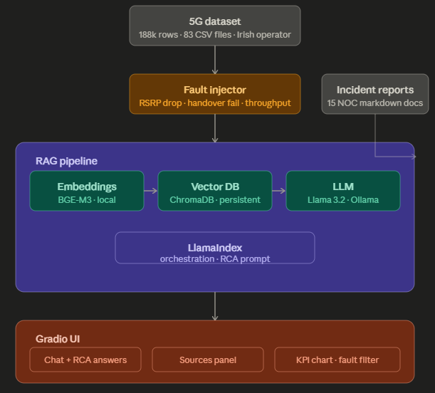
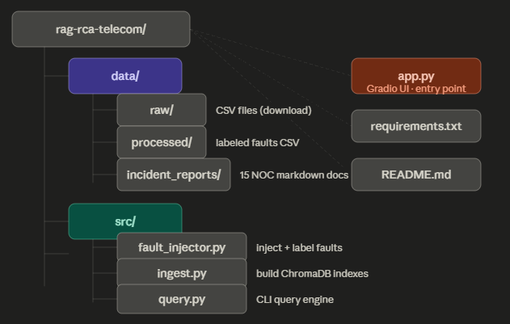

# 5G RAN Root Cause Analysis Assistant

A RAG-powered NOC assistant that diagnoses faults in 5G Radio Access Networks
using real KPI telemetry and structured incident reports. Built as a portfolio
project targeting telecom AI roles (Ericsson, Nokia, Telefónica).

## Demo

[▶ Watch the demo video](https://www.youtube.com/watch?v=Af8odyi2BcY)

---

## What it does

Ask natural language questions about 5G network faults and get structured,
source-cited root cause analysis in seconds:

- **Fault type identification** — classifies faults as RSRP drop, handover failure, or throughput collapse
- **KPI evidence retrieval** — surfaces the most relevant log entries from 188k real 5G measurements
- **Incident report grounding** — cites from 15 structured NOC incident reports
- **Resolution steps** — recommends concrete remediation actions per fault type

---

## Architecture



## Dataset

Based on the [uccmisl/5Gdataset](https://github.com/uccmisl/5Gdataset) —
real 5G KPI traces collected from a major Irish mobile operator across
Amazon Prime, Netflix, and file download sessions in driving and static scenarios.

Faults are synthetically injected with labeled ground truth for:
- `rsrp_drop` — signal coverage degradation (RSRP < -110 dBm)
- `handover_failure` — CellID flapping + zero throughput window
- `throughput_collapse` — DL bitrate collapse with normal signal

| Metric | Value |
|---|---|
| Total rows | 188,711 |
| Source files | 83 CSV files |
| Faulted rows | 9,660 (5.1%) |
| Incident reports | 15 markdown docs |

---

## Tech stack

| Component | Choice |
|---|---|
| LLM | Llama 3.2 3B (Ollama, local) |
| Embeddings | BGE-M3 (HuggingFace, local) |
| RAG framework | LlamaIndex |
| Vector DB | ChromaDB (persistent) |
| UI | Gradio 6.x |
| Data | pandas, numpy |

Fully local — no OpenAI API, no cloud costs.

---

## Project structure


---

## Setup

**Requirements:** Python 3.10+, 16GB RAM, [Ollama](https://ollama.com) installed

**1. Clone and install**
```bash
git clone https://github.com/YOUR_USERNAME/rag-rca-telecom
cd rag-rca-telecom
python -m venv .venv
source .venv/bin/activate  # Windows: .venv\Scripts\activate
pip install -r requirements.txt
```

**2. Pull the LLM**
```bash
ollama pull llama3.2:3b
```

**3. Download the dataset**

Download [uccmisl/5Gdataset](https://github.com/uccmisl/5Gdataset) and place
the CSV files under `data/raw/5G-production-dataset/`.

**4. Run the pipeline**
```bash
python src/fault_injector.py   # inject faults → data/processed/
python src/ingest.py           # build vector indexes → chroma_db/
python app.py                  # launch Gradio UI at http://127.0.0.1:7860
```

---

## Example queries

- *"Why is cell 12 experiencing throughput collapse despite good signal?"*
- *"What is causing handover failures in the driving scenario?"*
- *"Why has RSRP dropped below -110 dBm on multiple cells?"*
- *"What should I check if DL bitrate collapses but RSRP looks normal?"*

---

## Roadmap / future work

- Multi-turn conversation memory
- Alert severity classifier (critical / warning / info)
- Real-time KPI streaming simulation
- Second dataset integration (5G3E or ITU challenge data)
- Docker one-command deployment

---

## References

- Pötsch et al., *A 5G Dataset* — uccmisl/5Gdataset (2020)
- ETSI TS 138 214 — 5G NR physical layer procedures
- O-RAN Alliance Technical Specifications